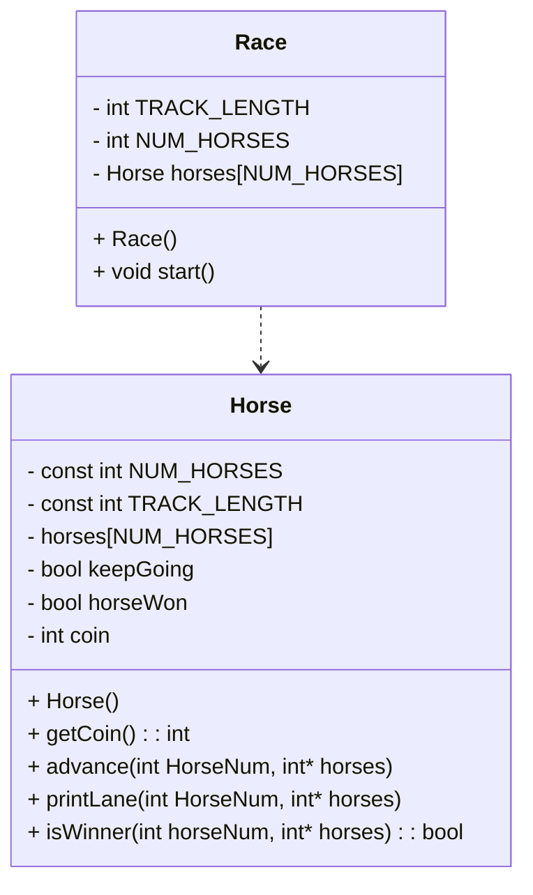

# OOP HorseRace documentation

## UML diagram

#Got this far and realised I don't think this is right. Wouldn't there need to be getters and setters for those attributes? I feel like maybe some of them shouldn't be there. 
