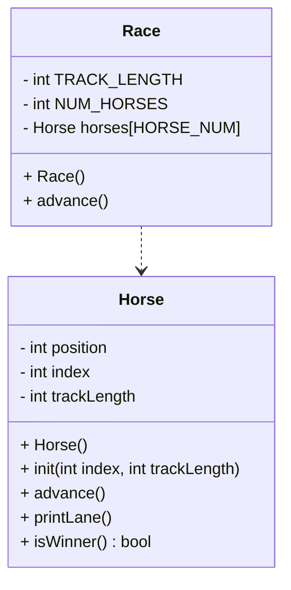

# OOP HorseRace documentation
```(remember index is which horse number I am, position is where on the track I am)```

## UML diagram


## Race()

```
int header
	set const static int NUM_HORSES to 5
	set const int TRACK_LENGTH to 15
int constructor
	for loop each horse
	initialize the horse by calling it's init
```

## Race.advance()
```
set bool keepGoing to true
while keepGoing:
	for each horse:
		advance that horse
		print horse lane
		if horse wins:
			set keepGoing to false
```

## Horse::Horse()
```
set position to 0
set index to 0
set track_length to 15
```

## void Horse::init(int index, int trackLength)
```
	my index = parameter index
	my trackLength = parameter trackLength
	my position = 0
```

## void Horse::advance()
```
coin = a random 0-1 int
add coin to position
```

## void Horse::printLane()
```
for position from 0 to trackLength:
	if position == my position:
		print my index
	else:
		print "."
print n/
```

## bool Horse::isWinner()
```
bool result = false
if position >= trackLength:
	result = true
	print that you won
return result
```


